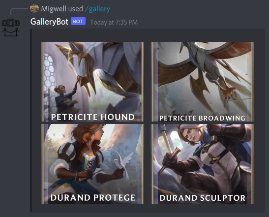

# GalleryBot

### [Invite GalleryBot to your server here](https://discord.com/api/oauth2/authorize?client_id=941226891896033310&scope=applications.commands)

Gallery Bot is a simple discord bot that takes up to 4 image uploads, and returns them as a gallery, like those used by Facebook Messenger, Twitter etc.
This allows you to share multiple images without taking up much screen real-estate.

Here is an example usage:

Which produces:

Like with e.g. Twitter links, you can click on individual images to zoom in on them.

## Feedback

[Please file issues and suggest features here](https://github.com/multimeric/GalleryBot/issues)

## Technical Detail

This uses a small hack [explained here](https://github.com/discord/discord-api-docs/discussions/3253#discussioncomment-952628) to enable galleries, which are a built-in but hidden Discord feature.